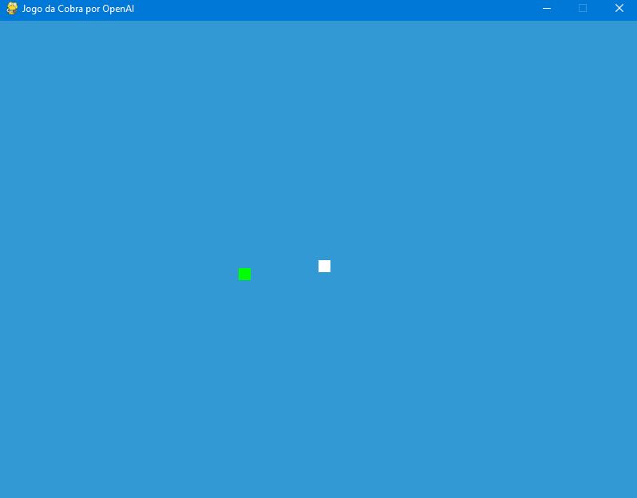

# jogos
portfolio de jogos em python

"""
Jogo da Cobra em Python usando Pygame
Autor: Seu Nome
"""

import pygame
import time
import random

# Configurações do jogo
DIS_WIDTH = 800
DIS_HEIGHT = 600
SNAKE_BLOCK = 10
SNAKE_SPEED = 15

# Inicialização do Pygame
pygame.init()
DIS = pygame.display.set_mode((DIS_WIDTH, DIS_HEIGHT))
pygame.display.set_caption('Jogo da Cobra por Seu Nome')

# Cores
WHITE = (255, 255, 255)
GREEN = (0, 255, 0)
RED = (213, 50, 80)
BLUE = (50, 153, 213)

# Relógio do jogo
clock = pygame.time.Clock()

# Fonte para mensagens
font_style = pygame.font.SysFont(None, 50)

def our_snake(snake_block, snake_list):
    for x in snake_list:
        pygame.draw.rect(DIS, WHITE, [x[0], x[1], snake_block, snake_block])

def message(msg, color):
    mesg = font_style.render(msg, True, color)
    DIS.blit(mesg, [DIS_WIDTH / 6, DIS_HEIGHT / 3])

def game_loop():
    game_over = False
    game_close = False

    x1 = DIS_WIDTH / 2
    y1 = DIS_HEIGHT / 2

    x1_change = 0
    y1_change = 0

    snake_list = []
    length_of_snake = 1

    foodx = round(random.randrange(0, DIS_WIDTH - SNAKE_BLOCK) / 10.0) * 10.0
    foody = round(random.randrange(0, DIS_HEIGHT - SNAKE_BLOCK) / 10.0) * 10.0

    while not game_over:

        while game_close:
            DIS.fill(BLUE)
            message("Você perdeu! Pressione Q-Quit ou C-Jogar Novamente", RED)
            pygame.display.update()

            for event in pygame.event.get():
                if event.type == pygame.KEYDOWN:
                    if event.key == pygame.K_q:
                        game_over = True
                        game_close = False
                    if event.key == pygame.K_c:
                        game_loop()

        for event in pygame.event.get():
            if event.type == pygame.QUIT:
                game_over = True
            if event.type == pygame.KEYDOWN:
                if event.key == pygame.K_LEFT:
                    x1_change = -SNAKE_BLOCK
                    y1_change = 0
                elif event.key == pygame.K_RIGHT:
                    x1_change = SNAKE_BLOCK
                    y1_change = 0
                elif event.key == pygame.K_UP:
                    y1_change = -SNAKE_BLOCK
                    x1_change = 0
                elif event.key == pygame.K_DOWN:
                    y1_change = SNAKE_BLOCK
                    x1_change = 0

        if x1 >= DIS_WIDTH or x1 < 0 or y1 >= DIS_HEIGHT or y1 < 0:
            game_close = True
        x1 += x1_change
        y1 += y1_change
        DIS.fill(BLUE)
        pygame.draw.rect(DIS, GREEN, [foodx, foody, SNAKE_BLOCK, SNAKE_BLOCK])
        snake_head = []
        snake_head.append(x1)
        snake_head.append(y1)
        snake_list.append(snake_head)
        if len(snake_list) > length_of_snake:
            del snake_list[0]

        for x in snake_list[:-1]:
            if x == snake_head:
                game_close = True

        our_snake(SNAKE_BLOCK, snake_list)

        pygame.display.update()

        if x1 == foodx and y1 == foody:
            foodx = round(random.randrange(0, DIS_WIDTH - SNAKE_BLOCK) / 10.0) * 10.0
            foody = round(random.randrange(0, DIS_HEIGHT - SNAKE_BLOCK) / 10.0) * 10.0
            length_of_snake += 1

        clock.tick(SNAKE_SPEED)

    pygame.quit()
    quit()

# Iniciar o loop principal do jogo
game_loop()

